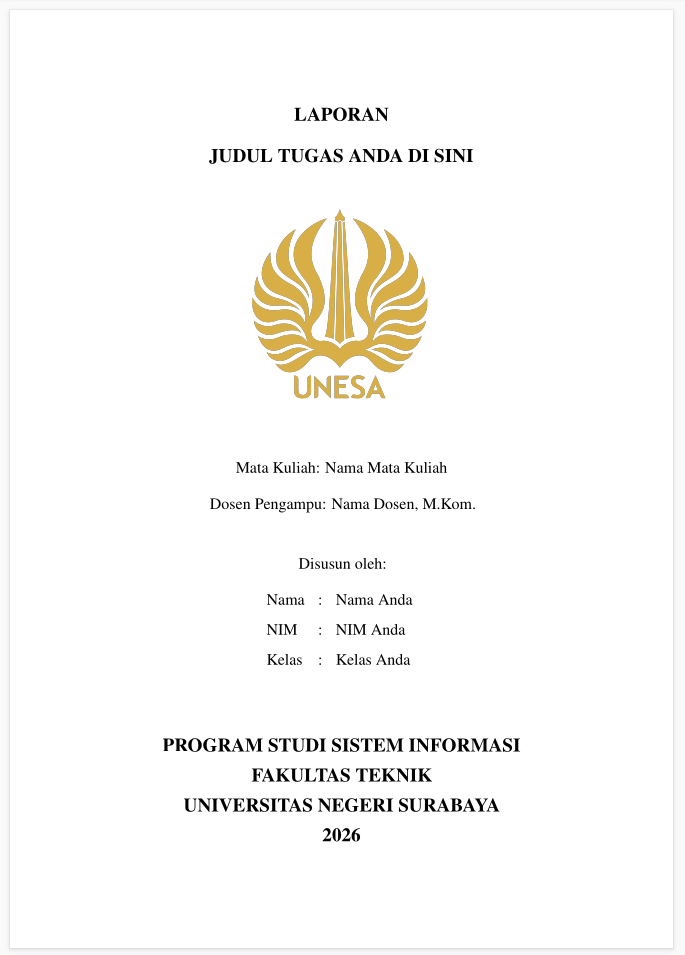
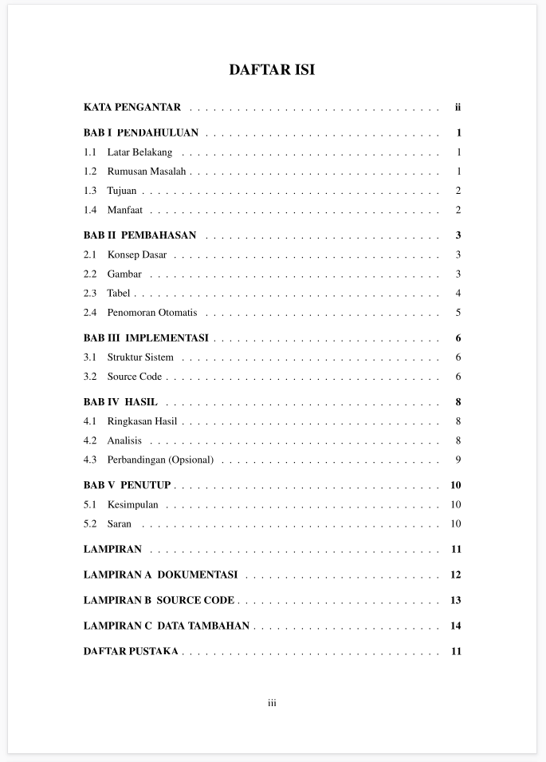
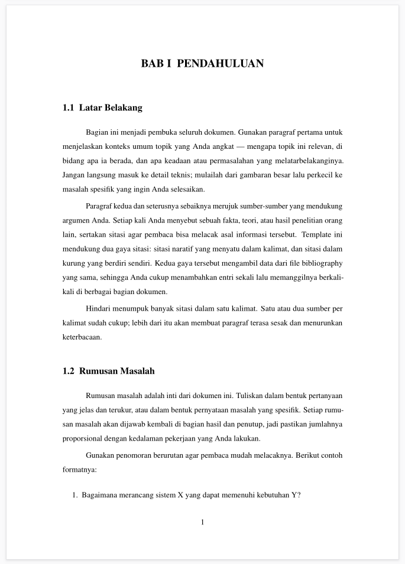
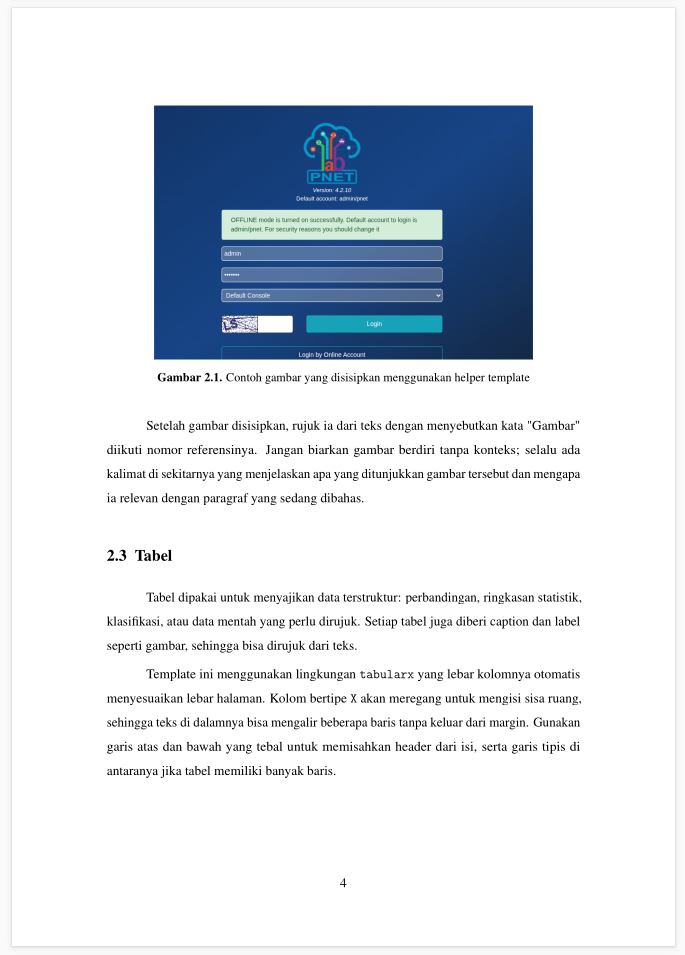
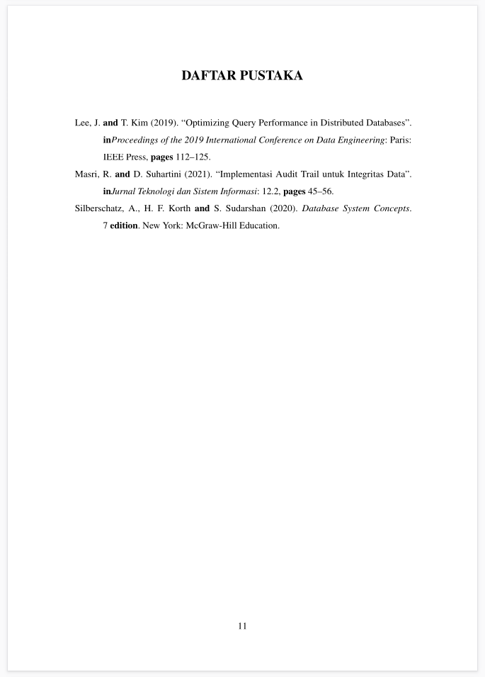

# LaTeX Report Template

A reusable LaTeX template for university assignments — lab reports, papers, project docs, whatever your lecturer throws at you. Set up your identity once, swap content per assignment, done.

## Preview

| Cover | Table of Contents | Body Text |
|:---:|:---:|:---:|
|  |  |  |

| Images & Tables | Bibliography |
|:---:|:---:|
|  |  |

## What's Inside

```
template-latex/
├── main.tex                 # Entry point. Controls page order.
├── config/
│   ├── metadata.tex         # Your name, NIM, course, title. Edit this first.
│   ├── packages.tex         # All \usepackage calls live here.
│   ├── settings.tex         # Margins, spacing, heading styles, TOC formatting.
│   └── commands.tex         # Custom helpers (\insertimage, listings setup, etc.)
├── sections/
│   ├── cover.tex            # Front page. Pulls data from metadata.tex — don't edit.
│   ├── kata-pengantar.tex   # Preface / acknowledgments.
│   ├── bab1.tex ... bab5.tex # Your chapters.
│   └── lampiran.tex         # Appendices (screenshots, source code, raw data).
├── references/
│   └── references.bib       # Bibliography database (BibLaTeX).
├── assets/
│   ├── logo-unesa.png       # University logo for the cover.
│   ├── contoh-gambar.png    # Sample image. Replace with your own.
│   └── screenshoot_hasil/   # Reference screenshots of the compiled output.
└── main.pdf                 # Last compiled output.
```

## First Time: Set Up Your Identity

Open `config/metadata.tex`. This is the only file you touch to change who's on the cover:

```latex
\newcommand{\documenttype}{Laporan}   % e.g. Makalah, Laporan Tugas, Laporan Proyek
\newcommand{\documenttitle}{Judul Tugas Anda Di Sini}
\newcommand{\coursename}{Nama Mata Kuliah}
\newcommand{\lecturername}{Nama Dosen, M.Kom.}
\newcommand{\studentname}{Nama Anda}
\newcommand{\studentnim}{NIM Anda}
\newcommand{\studentclass}{Kelas Anda}
\newcommand{\studyprogram}{Program Studi Sistem Informasi}
\newcommand{\faculty}{Fakultas Teknik}
\newcommand{\university}{Universitas Negeri Surabaya}
\newcommand{\reportyear}{2026}
```

The title on the cover gets uppercased automatically, so just type it normally.

## Per-Assignment Workflow

1. **Clone or copy** this repo into a new folder.
2. **Edit `config/metadata.tex`** — new title, course, lecturer.
3. **Rewrite the chapters** in `sections/bab1.tex` through `bab5.tex`. Each file starts with `\chapter{TITLE}` followed by your content. The current chapter files contain writing guides as placeholder text — replace them with your own content.
4. **Tweak `sections/lampiran.tex`** if your appendices differ (screenshots, code, data tables).
5. **Compile** (see below).

If a chapter doesn't apply, just clear its content or comment out the `\include{sections/babX}` line in `main.tex`.

## Adding Content

### Tables

Standard `tabularx` works out of the box. There's a working example in `sections/bab2.tex`:

```latex
\begin{table}[H]
    \centering
    \caption{Your caption}
    \label{tab:mylabel}
    \begin{tabularx}{\textwidth}{@{} l l X @{}}
        \toprule
        \textbf{Col A} & \textbf{Col B} & \textbf{Col C} \\
        \midrule
        ... & ... & ... \\
        \bottomrule
    \end{tabularx}
\end{table}
```

Reference it with `Tabel~\ref{tab:mylabel}`.

### Images

Drop files into `assets/` (or `assets/images/`) and use the helper:

```latex
\insertimage{assets/my-image.png}{Caption text}{fig:mylabel}
```

Then reference with `Gambar~\ref{fig:mylabel}`.

If the file doesn't exist yet, it renders a gray placeholder box instead of breaking the build. Useful when you're writing ahead of your screenshots.

### Code Listings

`listings` is configured with SQL and TypeScript support. Works with any language `listings` knows:

```latex
\begin{lstlisting}[language=SQL, caption={My query}]
SELECT * FROM transaksi WHERE id = 1;
\end{lstlisting}
```

Listings are numbered per chapter (Kode 1.1, Kode 2.3, etc.).

### Citations

Add entries to `references/references.bib` (standard BibLaTeX format). Then in your text:

```latex
\textcite{key}       % → Silberschatz et al. (2020)
\parencite{key}      % → (Masri and Suhartini, 2021)
```

Three entry types are pre-loaded as examples: `@book`, `@article`, `@inproceedings`. The bibliography renders with a hanging indent (1.27 cm).

## Compiling

The build order matters because of `biblatex` + `biber`. Run all four:

```bash
pdflatex main.tex
biber main
pdflatex main.tex
pdflatex main.tex
```

### VS Code (LaTeX Workshop)

Open the folder in VS Code with the LaTeX Workshop extension. It handles the `pdflatex → biber → pdflatex → pdflatex` chain automatically when it detects the bibliography. Just make sure `main.tex` is the active file and hit Build (or `Ctrl+Alt+B`).

### Overleaf

Zip the whole folder, upload via *New Project → Upload Project*. Overleaf picks the right compiler (pdflatex) by default. You should see the PDF on the right after the first build.

## Layout Notes

- **Margins:** 3 cm all sides (A4).
- **Line spacing:** 1.5.
- **Font:** Times New Roman (via `mathptmx`).
- **Chapters:** render as `BAB I`, `BAB II`, … Appendices as `LAMPIRAN A`, `LAMPIRAN B`, …
- **Front matter** (preface, TOC, list of tables/figures) uses Roman page numbers. Body starts at 1.
- **Table/figure captions** are numbered per chapter: Gambar 2.1, Tabel 3.2, etc.
- **Headers:** running chapter title on the left, page number centered in the footer.
- **Bibliography:** hanging indent 1.27 cm, `authoryear` style.

All of this lives in `config/settings.tex` if you need to tweak it.

## Using This Repo Across Assignments

Since this is a git repo, you have a few options:

```bash
# Fresh copy per assignment (cleanest)
git clone https://github.com/romitechdev/template-latex assignment-2
cd assignment-2
# edit metadata.tex + sections, compile, done.

# Or branch per assignment
git checkout -b lab-report-week3
# make changes, commit, push the branch
git push -u origin lab-report-week3
```

The committed `main.pdf` is just a snapshot of the last build — not sacred. Overwrite it every time you compile.
